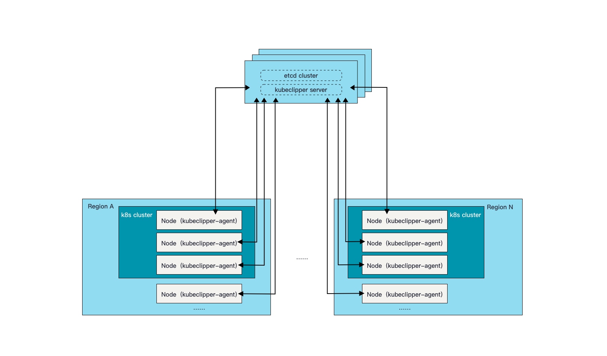

# Design

该文档主要简述系统的一些设计细节

## Arch



* `kubeclipper-server` 使用 `etcd` 作为存储。 `kubeclipper-server `与 `etcd` 部署在同一节点
* `kubeclipper-server` 向外暴露 HTTP API
* `kubeclipper-agent` 部署在节点上，采用自注册的方式向 kubeclipper-server 注册自己，并定时向 kubeclipper-server 发送心跳
* 同一 `Region` 中的节点可以组成一个 k8s 集群
* `kubeclipper-server` 通过 API 交互向 `kubeclipper-agent` 下发命令或操作
  * 目前 API 交互使用消息队列实现 (消息队列内置在 kubeclipper-server 中)
  * grpc 方式待实现

⚠️ 特别说明: 对于 kubeclipper-server 和 kubeclipper-agent 无法直连的情况需要加入服务级别的代理( 类似⻘云的 tower 或 k8s 的 konnectivity)

## 组件

* **etcd**: 后端存储
* **kubeclipper-server**: 服务端，向外暴露 API , 向 kubeclipper-agent 下发命令或操作
* **kubeclipper-agent**: 节点 agent, 向 kubeclipper-server 上报节点信息及状态，执行 kubeclipper-server 下 发的任务
* **kubeclipper-cli**:
  * 提供命令行操作，对接 kubeclipper-server 所有的 API
  * 提供部署 kubecliper 自身的能力 (部署，添加 agent 等)

## 插件设计

kubeclipper-server 将部署 k8s, docker, nfs 的操作都抽象成了对某种服务的部署 (docker, k8s) 为内置插件 插件的实现现在由**编译期注入**实现，后续可考虑动态注入方式(**以二进制程序注入**)

### 方案取舍

#### 编译期注入

实现 `plugin` 的接口，与 kubeclipper-server 代码一起编译，注册到服务中

#### 动态注入

实现 `plugin` 接口，单独编译，放在 kubeclipper-server 可访问的目录中，可以实现动态访问。

HA 部署 kubeclipper-server 的时候，**需要共享存储来存放插件**，让每个服务实例都能访问到相同的插件目录

考虑到 etcd 备份还原等功能也会用到存储，所以动态注入的方式后续是可以加入的。

两种方式对与前端的交互不会带了影响，都使用 json-scheme 来动态渲染页面表单

### k8s 发行版的支持

对原先的 k8s 插件 kubernetes/v1 更改为下述插件

* kubeadm: 插件名: kubeadm/v1
* k3s: 插件名: k3s/v1
* k0s: 插件名: k0s/v1

插件名是在 kubeclipper-server 中插件的唯一识别 ID

console 创建集群的入口:

1. 点击创建集群
2. 根据后端 API `/plugins` 获取部署 k8s 的插件，得到 kubeadm, k3s, k0s 等多种
3. 在界面上选择一种发行版，进入集群配置，每个插件的集群配置项不同

⚠️ 支持 k8s 多发行版带来的问题:
1. 前端很难动态渲染多种不同的集群创建流程，增加 k8s 发行版也需要在前端增加代码
2. 后端 cluster 对象中的字段需要包含所有支持的 k8s 发行版配置 ( 部署操作可以通过插件扩展，但是结构体字段没有办法完全动态，主要还是客户端使用带来的影响)

## 用户角色设计

使用 RBAC, 同 k8s rbac 模型，分为 `role` 和 `rolebinding`

### 结构体设计

```go
type User struct {
	metav1.TypeMeta `json:",inline"`
	// +optional
	metav1.ObjectMeta `json:"metadata,omitempty"`

	Spec UserSpec `json:"spec"`
	// +optional
	Status UserStatus `json:"status,omitempty"`
}

// UserSpec defines the desired state of User
type UserSpec struct {
	// Unique email address(https://www.ietf.org/rfc/rfc5322.txt).
	Email string `json:"email"`
	// The preferred written or spoken language for the user.
	// +optional
	Lang string `json:"lang,omitempty"`
	// User phone
	// +optional
	Phone string `json:"phone,omitempty"`
	// Description of the user.
	// +optional
	Description string `json:"description,omitempty"`
	// +optional
	DisplayName string `json:"displayName,omitempty"`
	// +optional
	Groups []string `json:"groups,omitempty"`
	// password will be encrypted by mutating admission webhook
	EncryptedPassword string `json:"password,omitempty"`
}

type GlobalRole struct {
	metav1.TypeMeta `json:",inline"`
	// +optional
	metav1.ObjectMeta `json:"metadata,omitempty"`

	// Rules holds all the PolicyRules for this GlobalRole
	// +optional
	Rules []rbacv1.PolicyRule `json:"rules" protobuf:"bytes,2,rep,name=rules"`
}

type GlobalRoleBinding struct {
	metav1.TypeMeta `json:",inline"`
	// +optional
	metav1.ObjectMeta `json:"metadata,omitempty"`

	// Subjects holds references to the objects the role applies to.
	// +optional
	Subjects []rbacv1.Subject `json:"subjects,omitempty" protobuf:"bytes,2,rep,name=subjects"`

	// RoleRef can only reference a GlobalRole.
	// If the RoleRef cannot be resolved, the Authorizer must return an error.
	RoleRef rbacv1.RoleRef `json:"roleRef" protobuf:"bytes,3,opt,name=roleRef"`
}

type LoginRecord struct {
	metav1.TypeMeta   `json:",inline"`
	metav1.ObjectMeta `json:"metadata,omitempty"`
	Spec              LoginRecordSpec `json:"spec"`
}

type LoginRecordSpec struct {
	// Which authentication method used, BasicAuth/OAuth
	Type LoginType `json:"type"`
	// Provider of authentication, Ldap/Github etc.
	Provider string `json:"provider"`
	// Source IP of client
	SourceIP string `json:"sourceIP"`
	// User agent of login attempt
	UserAgent string `json:"userAgent,omitempty"`
	// Successful login attempt or not
	Success bool `json:"success"`
	// States failed login attempt reason
	Reason string `json:"reason"`
}
```

## 节点生命周期管理

TODO @zhuxiaowei

## 实时日志

1. 使用封装后的 cmd 包将组件在 agent 节点上执行的命令与结果记录至以操作 ID 命名的日志文件中。
2. server 接收到操作日志 HTTP 请求（querystring 中指定 agent ID 与操作 ID），通过 nats 消息队列向 agent 发送实时日志请求消息，并携带一个唯一 ID。
3. agent 收到实时日志请求后，使用唯一的 ID 实例化 tailer 对象，持续观察日志文件的增量内容，并输出至一个缓冲区通道；agent 从 缓冲区通道读走日志（如果暂时无新的操作日志被写入日志文件将阻塞并等待），将其通过 nats 消息队列应答至 server。
4. server 同步地接收到包含日志内容的应答消息，继续同步地向 agent 发送实时日志请求消息。
5. 当客户端与 server 之间的 HTTP 的 TCP 连接断开（用户取消/网络中断），server 将向 agent 发送取消实时日志消息。
6. agent 收到取消消息后，对应的 tailer 对象停止观察日志文件。
